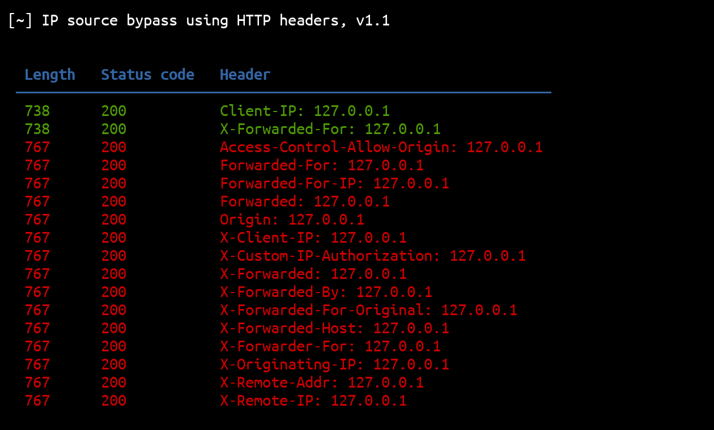

# ipsourcebypass

This Python script can be used to bypass IP source restrictions using HTTP headers.


## Features

 - [x] 17 HTTP headers.
 - [x] Multithreading.
 - [x] JSON export with `--json outputfile.json`.
 - [x] Autodetecting most successfull bypasses.

## Usage

```
$ ./ipsourcebypass.py -h
[~] IP source bypass using HTTP headers, v1.1

usage: ipsourcebypass.py [-h] [-v] -i IP [-t THREADS] [-x PROXY] [-k] [-L] [-j JSONFILE] url

This Python script can be used to test for IP source bypass using HTTP headers

positional arguments:
  url                   e.g. https://example.com:port/path

optional arguments:
  -h, --help            show this help message and exit
  -v, --verbose         arg1 help message
  -i IP, --ip IP        IP to spoof.
  -t THREADS, --threads THREADS
                        Number of threads (default: 5)
  -x PROXY, --proxy PROXY
                        Specify a proxy to use for requests (e.g., http://localhost:8080)
  -k, --insecure        Allow insecure server connections when using SSL (default: False)
  -L, --location        Follow redirects (default: False)
  -j JSONFILE, --jsonfile JSONFILE
                        Save results to specified JSON file.
```

## Autodetecting responses that stands out

Results are sorted by uniqueness of their response's length. This means that the results with unique response length will be on top, and results with response's length occuring multiple times at the bottom: 

| Two different result lengths | Four different result lengths  |
|------------------------------|--------------------------------|
|  |  |


## Contributing

Pull requests are welcome. Feel free to open an issue if you want to add other features.
